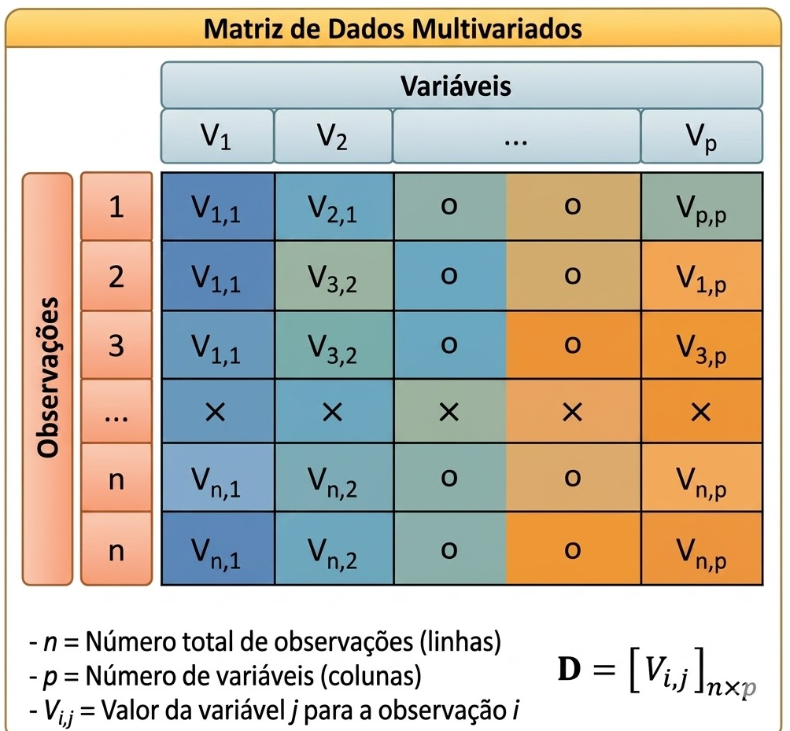

## Introdução

A análise exploratória de dados tem como objetivo sintetizar, descrever
e compreender as principais características de um conjunto de dados. Uma
forma clássica de fazer isso é por meio de um **resumo estatístico**, no
qual cada variável (coluna) é descrita por um conjunto padronizado de
medidas.

Essas medidas permitem identificar:

-   Tendência central (onde os dados se concentram);
-   Dispersão (o quanto os dados variam);
-   Forma da distribuição (simetria e caudas);
-   Presença de valores ausentes.

{#fig6 fig-align="center"
width="549"}

Neste capítulo, estudamos um conjunto completo de estatísticas
frequentemente organizadas em um *data frame resumo*, contendo uma linha
para cada medida e uma coluna para cada variável.

------------------------------------------------------------------------

## Medida

Considere um conjunto de dados com $p$ variáveis, onde:

-   Cada **coluna** representa uma variável;
-   Cada **linha** representa uma medida descritiva.

{#fig3
fig-align="center" width="549"}

As medidas analisadas são:

-   Número de observações ($n$)
-   Número de valores ausentes (NAs)
-   Mínimo e máximo
-   Quartis
-   Média, mediana e soma
-   Erro padrão e intervalo de confiança da média
-   Variância e desvio padrão
-   Assimetria (skewness)
-   Curtose (kurtosis)

:::: definicao
::: definicao-title
Definição 3.2.1
:::

O número de observações corresponde à quantidade de valores válidos (não
ausentes) em uma variável.

$$
n = \text{número de observações disponíveis}
$$ Essa medida indica o volume efetivo de dados utilizados na análise,
influenciando diretamente a confiabilidade dos resultados.
::::

O número de observações, usualmente representado por $n$, indica a
quantidade de dados efetivamente disponíveis para análise. Essa medida é
fundamental, pois influencia diretamente a confiabilidade das
estimativas estatísticas e a robustez das conclusões obtidas. Em geral,
quanto maior o valor de $n$, maior tende a ser a estabilidade dos
resultados.

:::: definicao
::: definicao-title
Definição 3.2.2
:::

Valores ausentes representam dados não observados ou não registrados em
uma variável.

$$
\text{NAs} = \text{número total de valores ausentes}
$$

A presença de valores ausentes pode reduzir o tamanho efetivo da amostra
e introduzir vieses na análise.
::::

Valores ausentes correspondem a informações não registradas ou
indisponíveis em um conjunto de dados. A presença desses valores pode
comprometer análises estatísticas, reduzindo o tamanho efetivo da
amostra e potencialmente introduzindo vieses. Por isso, é essencial
identificá-los e tratá-los adequadamente antes de proceder com a
análise.

Essas medidas são fundamentais para avaliar a **qualidade dos dados**.
Um grande número de valores ausentes pode comprometer análises
posteriores.

### Medidas de Posição

:::: definicao
::: definicao-title
Definição 3.2.1.1
:::

O valor mínimo corresponde ao menor valor observado em um conjunto de
dados.

$$
\min(x)
$$

Define o limite inferior dos dados e auxilia na identificação de valores
extremos.
::::

:::: definicao
::: definicao-title
Definição 3.2.1.2
:::

O valor máximo corresponde ao maior valor observado em um conjunto de
dados.

$$
\max(x)
$$

Define o limite superior da amostra.
::::

Essas medidas permitem identificar a amplitude dos dados e possíveis
valores extremos.

:::: definicao
::: definicao-title
Definição 3.2.1.3
:::
Os quartis são medidas que dividem os dados ordenados em quatro partes
iguais.

$$
Q_1, Q_2, Q_3
$$

O primeiro quartil (Q1) corresponde a 25% dos dados, o segundo (mediana)
a 50% e o terceiro (Q3) a 75%.
::::

São úteis para análise de dispersão e identificação de outliers.

:::: definicao
::: definicao-title
Definição 3.2.1.4
:::

A mediana é o valor central de um conjunto de dados ordenados.

$$
\text{Mediana} =
\begin{cases}
x_{\left(\frac{n+1}{2}\right)}, & \text{se } n \text{ ímpar} \\
\frac{x_{(n/2)} + x_{(n/2+1)}}{2}, & \text{se } n \text{ par}
\end{cases}
$$

É uma medida robusta, pouco sensível a valores extremos.
::::

:::: definicao
::: definicao-title
Definição 3.2.1.5
:::

A média aritmética representa o valor médio dos dados.

$$
\bar{x} = \frac{1}{n} \sum_{i=1}^{n} x_i
$$

É amplamente utilizada, porém sensível à presença de outliers.
::::

:::: definicao
::: definicao-title
Definição 3.2.1.6
:::

A soma corresponde ao total acumulado dos valores observados.

$$
\sum_{i=1}^{n} x_i
$$

É útil em análises de quantidades totais.
::::

### Medidas de Dispersão

:::: definicao
::: definicao-title
Definição 3.2.2.1
:::

A variância mede a dispersão dos dados em torno da média.

$$
s^2 = \frac{1}{n-1} \sum_{i=1}^{n} (x_i - \bar{x})^2
$$

Valores maiores indicam maior variabilidade.
::::

:::: definicao
::: definicao-title
Definição 3.2.2.2
:::

O desvio padrão é a raiz quadrada da variância.

$$
s = \sqrt{s^2}
$$

Expressa a dispersão na mesma unidade da variável.
::::

:::: definicao
::: definicao-title
Definição 3.2.2.3
:::

O erro padrão da média mede a variabilidade da média amostral.

$$
SE = \frac{s}{\sqrt{n}}
$$

Indica a precisão da estimativa da média populacional.
::::

:::: definicao
::: definicao-title
Definição 3.2.2.4
:::

O intervalo de confiança fornece uma faixa de valores plausíveis para a
média populacional.

$$
\bar{x} \pm t_{\alpha/2, n-1} \cdot \frac{s}{\sqrt{n}}
$$

Permite inferência estatística com um nível de confiança especificado.
::::

### Medidas de Forma da Distribuição

:::: definicao
::: definicao-title
Definição 3.2.3.1
:::
A assimetria mede o grau de inclinação da distribuição dos dados.

$$
\text{Skewness} = \frac{1}{n} \sum_{i=1}^{n} \left(\frac{x_i - \bar{x}}{s}\right)^3
$$

Indica se a distribuição é simétrica ou possui caudas assimétricas.
:::

Interpretação:

-   Skewness = 0 → distribuição simétrica\
-   Skewness \> 0 → cauda à direita\
-   Skewness \< 0 → cauda à esquerda

:::: definicao
::: definicao-title
Definição 3.2.3.2
:::

A curtose avalia o peso das caudas da distribuição.

$$
\text{Kurtosis} = \frac{1}{n} \sum_{i=1}^{n} \left(\frac{x_i - \bar{x}}{s}\right)^4 - 3
$$

Permite identificar distribuições com caudas pesadas ou leves.
:::

Interpretação:

-   Kurtosis ≈ 0 → distribuição normal\
-   Kurtosis \> 0 → caudas pesadas\
-   Kurtosis \< 0 → caudas leves

## Interpretação Conjunta

Ao analisar essas medidas em conjunto, é possível:

-   Detectar **outliers**;
-   Avaliar **dispersão**;
-   Identificar **assimetria**;
-   Entender o **formato da distribuição**;
-   Verificar a **qualidade dos dados**.

## Aplicações Práticas

Esse conjunto de estatísticas é amplamente utilizado em:

-   Análise exploratória de dados (EDA);
-   Relatórios estatísticos;
-   Controle de qualidade;
-   Economia e finanças;
-   Ciências sociais e biomédicas. ::::
