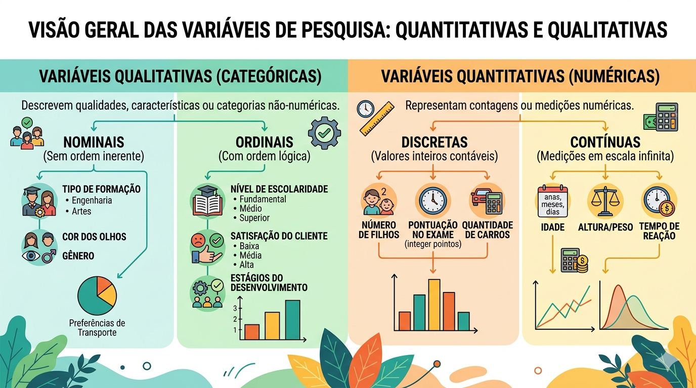
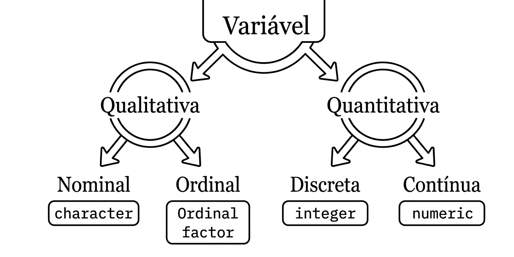

## Introdução {#sec-intro}

Neste capítulo inicial, estabeleceremos as bases fundamentais da estatística, diferenciando a análise puramente descritiva da inferência, e definindo os tipos de dados com os quais trabalharemos ao longo deste livro.

### O que é Estatística?

A estatística pode ser definida como a ciência que utiliza a probabilidade para lidar com a incerteza. Em um mundo inundado por dados, ela fornece as ferramentas para transformar observações brutas em conhecimento científico e suporte à decisão.

Podemos dividir a estatística em três grandes pilares:

1.  **Estatística Descritiva:** Etapa de organização, resumo e visualização dos dados.
2.  **Probabilidade:** O modelo matemático que quantifica a incerteza.
3.  **Estatística Inferencial:** O processo de tirar conclusões sobre uma população a partir de uma amostra.

### Conceitos Fundamentais

Antes de avançarmos para os cálculos, precisamos definir os objetos de estudo:

-   **População:** O conjunto total de elementos que compartilham pelo menos uma característica comum (ex: todos os domicílios do Brasil).
-   **Amostra:** Um subconjunto representativo da população.
-   **Parâmetro:** Uma medida numérica que descreve uma característica da população (geralmente desconhecida e representada por letras gregas como $\mu$ ou $\sigma$).
-   **Estimativa (ou Estatística):** Uma medida numérica calculada a partir de dados amostrais para estimar um parâmetro.

{#fig1 fig-align="center" width="549"}

### Classificação de Variáveis

A escolha da técnica estatística ou do modelo depende inteiramente da natureza da variável. As variáveis podem ser classificadas conforme o esquema abaixo:

#### Qualitativas (ou Categóricas)

Representam atributos ou qualidades que não possuem valor numérico intrínseco.

-   **Nominais:** Não existe uma ordem natural (ex: Sexo, Estado Civil, Cor/Raça).

-   **Ordinais:** Existe uma hierarquia ou ordenação (ex: Nível de escolaridade, Classe socioeconômica).

#### Quantitativas (ou Numéricas)

Representam contagens ou mensurações.

-   **Discretas:** Valores provenientes de contagem, geralmente números inteiros (ex: Número de filhos, total de crimes em uma região).

-   **Contínuas:** Valores que podem assumir qualquer número real em um intervalo (ex: Renda, Peso, Altura).

{#fig2 fig-align="center" width="549"}

### O Fluxo da Análise Estatística

Uma análise rigorosa geralmente segue o ciclo de vida dos dados:

1.  **Definição do Problema:** Identificação do objetivo da pesquisa.

2.  **Coleta de Dados:** Utilizando métodos como pesquisas e observações.

3.  **Processamento de Dados:** Preparação e limpeza para análise.

4.  **Análise Descritiva:** Uso de gráficos e medidas (onde as variáveis qualitativas e quantitativas da imagem anterior são aplicadas).

5.  **Análise Inferencial:** Testes de hipóteses e modelagem.

6.  **Interpretação e Relatório:** Conclusões e apresentação dos resultados (achados).

No próximo capítulo, exploraremos como utilizar o R para realizar a **Análise Exploratória de Dados**, focando em medidas de tendência central e dispersão.
