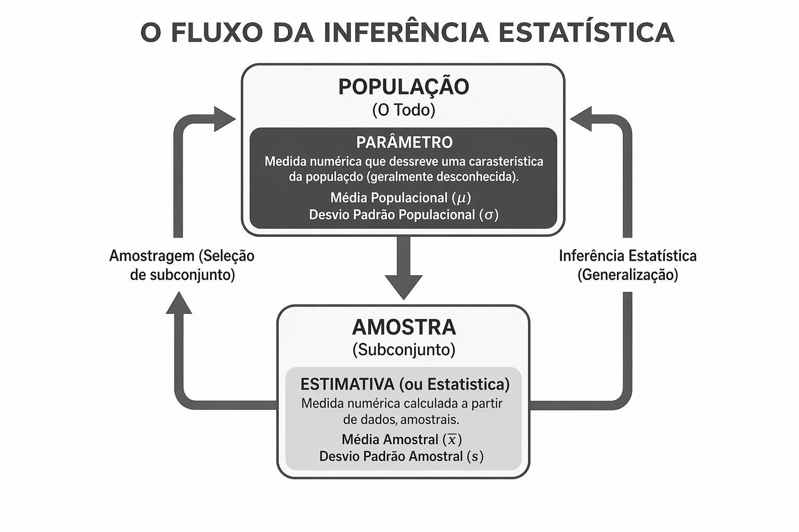

## Introdução {#sec-intro}

Neste capítulo inicial, estabeleceremos as bases fundamentais da estatística, diferenciando a análise puramente descritiva da inferência, e definindo os tipos de dados com os quais trabalharemos ao longo deste livro.

### O que é Estatística?

A Estatística pode ser definida como a ciência que utiliza a probabilidade para lidar com a incerteza. Em um mundo inundado por dados, ela fornece as ferramentas para transformar observações brutas em conhecimento científico e suporte à decisão.

Podemos dividir a estatística em três grandes pilares:

1.  **Descritiva:** Resume e organiza os dados históricos para descrever o que aconteceu, sem tirar conclusões externas.

2.  **Inferencial:** Usa amostras para tirar conclusões e generalizar propriedades sobre uma população inteira sob incerteza.

3.  **Preditiva**: utiliza algoritmos estatísticos e técnicas de machine learning para definir a probabilidade de eventos futuros com base em padrões encontrados em dados do passado.

De modo geral, a Estatística engloba ferramentas teóricas e práticas visando entender ou analisar o comportamento de informações quantitativas e/ou qualitativas, medindo incertezas e, dessa forma, auxiliando na tomada de decisão.

### Conceitos Fundamentais

Antes de avançarmos para a análise prática, precisamos definir os objetos de estudo:

-   **População:** O conjunto total de elementos que compartilham pelo menos uma característica comum (ex: todos os domicílios do Brasil).

-   **Parâmetro:** Uma medida numérica que descreve uma característica da população (geralmente desconhecida e representada por letras gregas como $\mu$, $\sigma$).

-   **Amostra:** Um subconjunto representativo da população.

-   E**stimativa (ou Estatística):** Uma medida numérica calculada a partir de dados amostrais para estimar um parâmetro, geralmente representada por letras maiúsculas ($\bar{X}$, $S$).

{fig-align="center" width="549"}

Alguns conceitos e definições matemáticas bem como suas propriedades são de extrema importância para um bom entendimento das técnicas de análise estatística. Entretanto, não será apresentado um capítulo a parte sobre esses conceitos e definições. Ao longo do livro, à medida que for sendo necessário, estes serão apresentados da forma mais simples possível, sem o rigor matemático.

#### Tipos de População

##### População Finita

É aquela que possui um número **determinado** e **limitado** de elementos. Em outras palavras, se você tivesse tempo e recursos infinitos, conseguiria contar todos os itens e chegar a um número final (N).

-   **A característica chave:** A contagem termina.

-   **Exemplos:**

    -   O número de alunos matriculados em uma escola em 2026.

    -   A quantidade de parafusos produzidos por uma máquina em um turno de 8 horas.

    -   O número de páginas de um livro de estatística.

    -   Os habitantes de uma cidade específica.

##### População Infinita

É aquela que possui um número de elementos tão grande que é **impossível listar todos**, ou cujos elementos ainda estão sendo gerados (processo contínuo). Na estatística, também tratamos como infinita uma população que é tecnicamente finita, mas tão vasta que o tamanho total não influencia no cálculo da amostra.

-   **A característica chave:** A contagem nunca termina ou é meramente teórica.

-   **Exemplos:**

    -   O número de vezes que uma moeda pode ser lançada (processo infinito).

    -   O conjunto de todos os números reais entre 0 e 1 (infinito não enumerável).

    -   O número de estrelas no universo observável (tão vasto que é tratado como infinito).

    -   A produção futura de uma fábrica que ainda não parou de operar.

#### Tipos de Amostragem: Probabilística vs. Não Probabilística

A amostragem é o processo de selecionar um subconjunto de indivíduos de uma população para estimar características do todo. A principal diferença entre os métodos reside na forma como os elementos são escolhidos.

##### Amostragem Probabilística

Na amostragem probabilística, todos os elementos da população têm uma probabilidade conhecida e diferente de zero de serem selecionados. Isso permite a generalização dos resultados com rigor estatístico.

-   **Amostragem Aleatória Simples (AAS):** Todos os itens têm a mesma chance de seleção. É como um sorteio de nomes em uma urna.

    -   *Exemplo:* Sortear 10 números de matrícula em uma lista de 100 alunos.

-   **Amostragem Estratificada:** A população é dividida em grupos (estratos) com características semelhantes, e uma amostra é coletada de cada estrato.

    -   *Exemplo:* Dividir uma empresa por departamentos e selecionar funcionários de cada área proporcionalmente.

-   **Amostragem Sistemática:** Os elementos são escolhidos seguindo um intervalo fixo (o enésimo termo).

    -   *Exemplo:* Selecionar cada 10ª peça que sai de uma linha de produção.

-   **Amostragem por Conglomerados (Clusters):** A população é dividida em grupos heterogêneos (conglomerados), e alguns desses grupos são escolhidos para estudo integral.

    -   *Exemplo:* Selecionar aleatoriamente 5 bairros de uma cidade e entrevistar todos os moradores desses bairros.

##### Amostragem Não Probabilística

Aqui, a seleção depende do julgamento do pesquisador ou de critérios de conveniência. Não é possível calcular o erro amostral, e os resultados não podem ser extrapolados para toda a população com precisão estatística.

-   **Amostragem por Conveniência:** Os dados são coletados de pessoas que estão "à mão".

    -   *Exemplo:* Entrevistar pessoas que passam na porta de um shopping em um determinado horário.

-   **Amostragem por Cotas:** Semelhante à estratificada, mas a escolha dos indivíduos dentro de cada grupo não é aleatória.

    -   *Exemplo:* O pesquisador precisa entrevistar 50 homens e 50 mulheres, escolhendo os primeiros que encontrar.

-   **Amostragem por Julgamento (ou Intencional):** O pesquisador escolhe casos que considera "típicos" ou especialistas no assunto.

    -   *Exemplo:* Entrevistar apenas diretores de RH para entender tendências de contratação.

-   **Amostragem Bola de Neve (Snowball):** Os primeiros participantes indicam novos participantes. Muito usada em populações de difícil acesso.

    -   *Exemplo:* Pesquisas com colecionadores de itens raros ou grupos sociais restritos.

### Aplicações em R

```{r setup, include=TRUE, warning=FALSE}

library(dplyr) # carregando o pacote dplyr

set.seed(123) # Para reprodutibilidade

# Gerando os dados da população

populacao <- data.frame(
  id = 1:1000,
  departamento = rep(c("TI", "RH", "Vendas", "Finanças"), each = 250),
  experiencia = rnorm(1000, mean = 5, sd = 2)
)

# Amostragem probabilísticas
# Amostragem aleatória simples

amostra_simples <- populacao %>% 
  dplyr::slice_sample(n = 100) # Seleciona 100 funcionários ao acaso

# Amostragem estratificada

amostra_estratificada <- populacao %>%
  dplyr::group_by(departamento) %>%
  dplyr::slice_sample(prop = 0.1) # Seleciona 10% de cada departamento

# Amostragem sistemática

N <- nrow(populacao)
n <- 100
salto <- N / n
inicio <- sample(1:salto, 1)

indices <- seq(from = inicio, to = N, by = salto)
amostra_sistematica <- populacao[indices, ]

# Amostragem por conglomerados

# --- Amostragem por Conglomerados (Cluster Sampling) ---

# 1. Definimos nossos conglomerados (neste caso, os Departamentos)
conglomerados_disponiveis <- unique(populacao$departamento)

# 2. Sorteamos quais conglomerados farão parte da amostra
# Vamos sortear 2 departamentos dos 4 existentes
set.seed(456)
conglomerados_sorteados <- sample(conglomerados_disponiveis, size = 2)

# 3. Incluímos TODOS os indivíduos dos departamentos sorteados
amostra_conglomerados <- populacao %>%
  dplyr::filter(departamento %in% conglomerados_sorteados)

# Verificação:
cat("Departamentos sorteados:", conglomerados_sorteados, "\n")
table(amostra_conglomerados$departamento)

# Amostras não probabilísticas
# Amostragem por conveniência

amostra_conveniencia <- populacao %>%
  head(50)

# Amostragem por cotas

amostra_cotas <- dplyr::bind_rows(
  populacao %>% dplyr::filter(departamento == "TI") %>% dplyr::slice_head(n = 20),
  populacao %>% dplyr::filter(departamento == "Vendas") %>% dplyr::slice_head(n = 20)
)

# Comparação das médias das amostras geradas

data.frame(
  Metodo = c("População Total", "Aleatória Simples", "Estratificada", "Conveniência"),
  Media_Exp = c(
    mean(populacao$experiencia),
    mean(amostra_simples$experiencia),
    mean(amostra_estratificada$experiencia),
    mean(amostra_conveniencia$experiencia)
  )
)
```

###### O Duelo dos Grupos: Estratificada vs. Conglomerados

Embora ambas dividam a população em subgrupos, a lógica de funcionamento é inversa. A escolha entre uma ou outra depende do seu objetivo: precisão estatística ou economia logística.

### 1. Amostragem Estratificada: "Um pouco de cada"

Aqui, o objetivo é a **precisão**. Queremos garantir que nenhum subgrupo importante (estrato) fique de fora.

-   **Composição:** Os estratos são **homogêneos internamente** (as pessoas dentro do grupo são parecidas, ex: apenas mulheres) e **heterogêneos entre si** (os grupos são bem diferentes uns dos outros).

-   **O Sorteio:** Todos os estratos participam. O sorteio (AAS) acontece **dentro** de cada um deles.

-   **Exemplo:** Para entender a renda de um país, dividimos a população por classes sociais (A, B, C...). Sorteamos pessoas de todas as classes para garantir que a classe A não seja esquecida.

### 2. Amostragem por Conglomerados: "Tudo de alguns"

Aqui, o objetivo é a **eficiência e baixo custo**. É ideal quando a população está muito dispersa.

-   **Composição:** Os conglomerados são **heterogêneos internamente** (cada grupo é uma "mini população" com diversidade) e **homogêneos entre si** (um grupo é muito parecido com o outro).

-   **O Sorteio:** O sorteio acontece na **unidade do grupo**. Selecionamos alguns conglomerados e estudamos **todos** os indivíduos dentro deles.

-   **Exemplo:** Para pesquisar a saúde de alunos em uma cidade, sorteamos 10 escolas (conglomerados) e entrevistamos todos os alunos dessas 10 escolas, em vez de viajar a todas as centenas de escolas da cidade.

## Comparação entre Métodos de Amostragem

No Quadro 1, apresentamos a distinção técnica entre os dois principais métodos de seleção por grupos, focando na composição interna e na lógica de sorteio.

| Característica | Amostragem Estratificada | Amostragem por Conglomerados |
|:-----------------------|:-----------------------|:-----------------------|
| **Dentro do Grupo** | Elementos **Homogêneos** (parecidos entre si) | Elementos **Heterogêneos** (diversos entre si) |
| **Entre os Grupos** | Grupos **Heterogêneos** (diferentes entre si) | Grupos **Homogêneos** (parecidos entre si) |
| **Unidade de Sorteio** | O **indivíduo** (dentro de cada estrato) | O **conglomerado** (o grupo como um todo) |
| **Presença na Amostra** | **Todos** os estratos são representados | **Apenas alguns** conglomerados são sorteados |
| **Objetivo Principal** | Aumentar a **precisão** dos estimadores | Reduzir **custos e logística** de coleta |

: Quadro 1: Amostragem estratificada e amostragem por conglomerados. {#tbl-amostragem}

No próximo capítulo, vamos tratar da análise exploratória de dados.

:::: exercicio
Exercício 1: identificação de População e Amostra

::: exercicio-title
*Para cada cenário abaixo, identifique a **População** e a **Amostra**.*

1.  Um pesquisador quer saber a altura média dos alunos de uma universidade com 20.000 estudantes e entrevista 500 deles.

2.  Para testar a qualidade de um lote de 10.000 lâmpadas, uma fábrica seleciona 100 para teste de durabilidade.

3.  Um inspetor de alimentos analisa 5 latas de conserva de um carregamento que chegou ao supermercado.

4.  Um sociólogo entrevista 1.200 brasileiros para entender a opinião do país sobre o trabalho remoto.

5.  Em um hospital, o médico analisa o exame de sangue (uma gota) de um paciente para verificar o nível de glicose.

6.  Um analista de dados examina 200 transações de um banco que processa milhões de operações por dia para detectar fraudes.

7.  Um biólogo estuda 50 árvores de uma floresta nacional para estimar a idade média da vegetação local.

8.  Uma loja de roupas quer saber a satisfação dos seus 5.000 clientes e envia um formulário que é respondido por 300 pessoas.

9.  Para verificar a eficácia de uma nova vacina, cientistas acompanham um grupo de 10.000 voluntários ao redor do mundo.

10. Um controle de qualidade de vinhos testa três garrafas de uma safra anual de 50.000 garrafas.
:::
::::

:::: exercicio
Exercício 2: Identificação de Parâmetro e Estimativa

::: exercicio-title
*Classifique o valor em destaque como **Parâmetro** (referente à população) ou **Estimativa** (referente à amostra).*

1.  O **Censo do IBGE** revelou que a idade média da população brasileira aumentou.

2.  Uma **pesquisa eleitoral** indica que 35% dos entrevistados pretendem votar no Candidato A.

3.  O gerente de uma loja verificou **todas as notas fiscais** do dia e viu que o gasto médio foi de R\$ 150,00.

4.  Com base em 40 laranjas testadas, um agrônomo afirmou que **aquelas laranjas** possuem 12% de açúcar.

5.  O registro oficial de **todos os funcionários** de uma empresa mostra que 60% são mulheres.

6.  Um teste de colisão com **5 carros de um modelo** indica que a segurança do modelo é nota 9.

7.  A média de gols de **toda a história da Copa do Mundo** é de 2,8 por partida.

8.  Em um estudo com **100 fumantes**, observou-se que 20% desenvolveram problemas respiratórios.

9.  O Banco Central divulgou a taxa oficial de inflação acumulada de **todo o ano anterior**.

10. Após provar **uma colher** de sopa, o cozinheiro disse: "Falta sal".
:::
::::

:::: exercicio
Exercício 3: Aplicação

::: exercicio-title
*Responda com base nos conceitos aprendidos.*

1.  Por que, no caso do exame de sangue, usamos uma amostra e não a população total?

2.  Se um pesquisador consegue entrevistar **todos** os elementos de um grupo, ele está realizando um Censo ou uma Amostragem?

3.  Explique por que uma estimativa pode variar de uma amostra para outra, enquanto o parâmetro é um valor único e fixo (em um dado momento).

4.  Imagine que você quer saber a opinião dos brasileiros sobre futebol. Entrevistar apenas pessoas na porta de um estádio geraria uma amostra fiel? Por quê?

5.  Um parâmetro é geralmente um valor conhecido ou desconhecido na prática científica? Justifique.

6.  Qual a principal vantagem de usar uma amostra em vez de investigar toda a população em uma fábrica de fogos de artifício?

7.  Se aumentarmos o tamanho de uma amostra, o que se espera que aconteça com a diferença entre a estimativa e o parâmetro?

8.  Dê um exemplo de uma situação onde a população é **infinita**.

9.  Dê um exemplo de uma situação onde a população é **finita**, mas o uso de amostra é obrigatório por questões de custo.

10. Crie um cenário original identificando os quatro conceitos: População, Parâmetro, Amostra e Estimativa.
:::
::::
